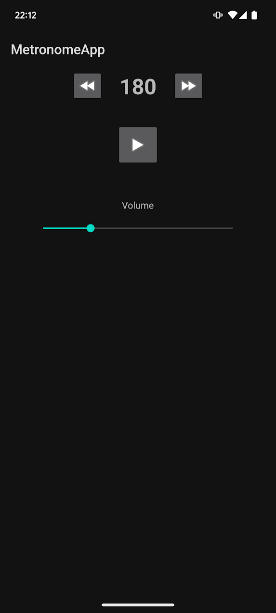

Here’s a quick summary of what you selected:

Template:

Empty Activity: A minimal starting point for your app with no unnecessary features.
Language:

Kotlin: Modern and officially recommended by Google for Android development. Cleaner syntax and better tooling than Java.
Build Configuration:

Kotlin DSL: Your build.gradle files use Kotlin script (.kts) for better type safety, code completion, and easier configuration.
Minimum SDK:

API 28 (Android 9.0 Pie): Ensures compatibility with ~92.5% of Android devices while supporting modern features.
App Name and Package:

App Name: MetronomeApp.
Package Name: com.example.metronomeapp.
Project Structure:

A clean project with MainActivity.kt (your starting point), activity_main.xml (for UI), and Kotlin DSL-based build files.

# MetronomeApp

A precise and reliable metronome application for Android with background playback support and persistent settings.

## Features

- Accurate BPM timing (40-240 BPM range)
- Adjustable volume control
- Background playback support
- Persistent settings (remembers last used BPM and volume)
- Low-latency audio using SoundPool
- Clean, minimalist UI
- Works simultaneously with other audio apps
- Proper cleanup when swiped away from recent apps

## Technical Implementation

### Core Components

- **SoundPool API**: Used for low-latency audio playback
- **Foreground Service**: Enables background operation
- **SharedPreferences**: Stores user settings
- **Coroutines**: Handles precise timing

### Project Structure

- `app/src/main/java/com/example/metronomeapp/`
  - `MainActivity.kt`: Main UI and controls
  - `MetronomeService.kt`: Background service for metronome playback
  - `AudioEngine.kt`: Handles audio generation and playback
  
- `app/src/main/res/`
  - `layout/activity_main.xml`: Main UI layout
  - `raw/click.wav`: Metronome sound file

## Permissions Required

<uses-permission android:name="android.permission.FOREGROUND_SERVICE" />
<uses-permission android:name="android.permission.FOREGROUND_SERVICE_MEDIA_PLAYBACK" />

This metronome app is designed to be lightweight and reliable, with special attention paid to audio handling to ensure smooth operation alongside other audio apps.

## License

MIT License

Copyright (c) 2024 oasdflkjo

Permission is hereby granted, free of charge, to any person obtaining a copy
of this software and associated documentation files (the "Software"), to deal
in the Software without restriction, including without limitation the rights
to use, copy, modify, merge, publish, distribute, sublicense, and/or sell
copies of the Software, and to permit persons to whom the Software is
furnished to do so, subject to the following conditions:

The above copyright notice and this permission notice shall be included in all
copies or substantial portions of the Software.

THE SOFTWARE IS PROVIDED "AS IS", WITHOUT WARRANTY OF ANY KIND, EXPRESS OR
IMPLIED, INCLUDING BUT NOT LIMITED TO THE WARRANTIES OF MERCHANTABILITY,
FITNESS FOR A PARTICULAR PURPOSE AND NONINFRINGEMENT. IN NO EVENT SHALL THE
AUTHORS OR COPYRIGHT HOLDERS BE LIABLE FOR ANY CLAIM, DAMAGES OR OTHER
LIABILITY, WHETHER IN AN ACTION OF CONTRACT, TORT OR OTHERWISE, ARISING FROM,
OUT OF OR IN CONNECTION WITH THE SOFTWARE OR THE USE OR OTHER DEALINGS IN THE
SOFTWARE.

## Attribution

If you use this code in your project, please provide attribution by linking to this repository and including the copyright notice.